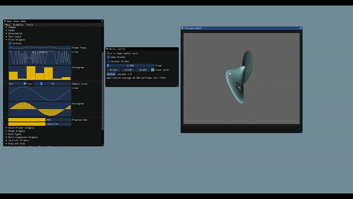

# VTK Widget for DearImGUI

* An effort to incorporate VTK's dataset visualization capabilities with versatility of DearImGUI.
* Renders VTK content into a viewport within an ImGui Window
* Look in `main.cpp` for details on example usage.

## Changes vs. [trlsmax/imgui-vtk](https://github.com/trlsmax/imgui-vtk)
- `imgui_impl_vtk` files are now deprecated in favor of using VtkViewer objects.
- Uses VTK OpenGLRenderWindow's framebuffer directly
- Fixes/upgrades IO behavior
- Uses ImGui's `docking` branch
- Includes `imgui`, `gl3w`, and `glfw` as git submodules in this repository
- Builds components separately in `CMakeLists.txt` and links them as static libraries
- Supports multiple independent VtkViewer instances/windows
- Usage (see `main.cpp` for details)
  - Previous: ImGui window is created for you
  - Current: Create (and end) ImGui window yourself
    - Allows you to place other widgets in same window as VTK "viewport"



## Usage:
- See `main.cpp`

```
dataset = ..
filter = ..
mapper1 = ..
mapper2 = ..
actor1 = ..
actor2 = ..
filter->SetInputData(dataset);

mapper1->SetInputConnection(filter->GetOutputPort(0));
mapper2->SetInputConnection(filter->GetOutputPort(1));
...

actor1->SetMapper(mapper1);
actor2->SetMapper(mapper2);
...

ImguiInit...

VtkViewer myVtkViewer;               // create VTKViewer object
myVtkViewer.addActor(myActor);       // give it an actor

while (!terminate)
{
  Imgui new frame..
  custom imgui windows..

  // VTK Viewer Window
  ImGui::Begin("My VTK Viewer");
  myVtkViewer.render();              // render VtkViewer within window
  ImGui::End();

  ImGui::Render();
  ImGui_Impl_xxx_RenderDrawData();
}
```
